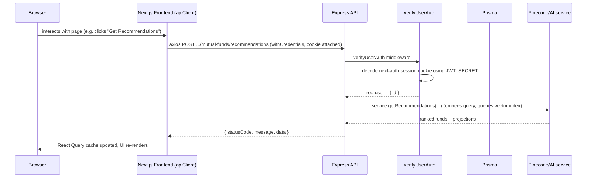

# 📘 AI Mutual Fund System — Technical Documentation

> Compiled by static analysis of the repository (no code was modified). Where the codebase is ambiguous or incomplete, this is explicitly flagged rather than assumed.

---

## 1. Project Purpose

**What it is:** "WealthAI" — a full-stack platform (branded in the frontend UI as *WealthAI*) that combines **AI-powered mutual fund recommendations** with a **simulated stock trading and wallet system**.

**Problem it solves** (per `README.md` and the code): Retail investors find mutual fund investing complex, and choosing the "right" fund among thousands of options is hard. This project:
- Lets a user enter an investment amount, tenure, category/AMC preference, and investment type (SIP/Lump sum).
- Uses **semantic vector search (Pinecone + Google Gemini embeddings)** over a mutual-fund dataset to recommend funds that match the user's intent, along with AI-projected returns.
- Additionally provides a **paper-trading module** (stocks, positions, orders, watchlist) and a **wallet module** (deposit/withdraw/balance/transaction ledger) so a user can simulate investing the recommended amount.

**Scope note:** The stock market data (indices, trending stocks, gainers/losers) is **hardcoded/mocked** in the backend controller, not sourced from a real market-data API — see [servers/express-server/controller/trading.controller.ts](servers/express-server/controller/trading.controller.ts). This is a simulation, not a real brokerage integration.

---

## 2. Complete Tech Stack

| Layer | Technology | Notes |
|---|---|---|
| Monorepo tooling | **Turborepo** + **pnpm workspaces** | [turbo.json](turbo.json), [pnpm-workspace.yaml](pnpm-workspace.yaml) |
| Language | **TypeScript** everywhere | shared configs in [packages/typescript-config](packages/typescript-config) |
| Frontend framework | **Next.js 16** (App Router), **React 18.3** | [mutualFundUi](mutualFundUi) |
| Frontend state/data | **TanStack React Query v5** (server state/cache), React local state | [mutualFundUi/app/providers/QueryProvider.tsx](mutualFundUi/app/providers/QueryProvider.tsx) |
| Frontend HTTP client | **Axios** | [mutualFundUi/app/lib/api.ts](mutualFundUi/app/lib/api.ts) |
| Frontend UI | **Tailwind CSS 4**, **Radix UI** primitives, **MUI (@mui/material)**, **Recharts** (charts), **Lucide** icons, **Sonner** (toasts), **react-hook-form** | [mutualFundUi/app/components](mutualFundUi/app/components) |
| Frontend auth | **NextAuth.js v4** (Google OAuth provider, JWT session strategy) | [mutualFundUi/app/lib/auth.ts](mutualFundUi/app/lib/auth.ts) |
| Backend framework | **Express 5** | [servers/express-server](servers/express-server) |
| Backend security/middleware | **Helmet**, **CORS**, **cookie-parser**, **Morgan** (logging) | [servers/express-server/app/app.ts](servers/express-server/app/app.ts) |
| Backend auth verification | **next-auth (server-side `decode()`)** + **jsonwebtoken** | [servers/express-server/controller/user.controller.ts](servers/express-server/controller/user.controller.ts) |
| Backend scaling | **Node.js `cluster` module** (multi-process) | [servers/express-server/clusterManager/clusterManager.ts](servers/express-server/clusterManager/clusterManager.ts) |
| ORM / Database client | **Prisma 7** (`@prisma/client`, `@prisma/adapter-pg`) | [database/Prisma](database/Prisma) |
| Database | **PostgreSQL** | via `PrismaPg` adapter |
| AI / Vector search | **Pinecone** (vector DB), **Google Gemini `text-embedding-004`** (768-dim embeddings, default), optional **OpenAI** embeddings via Vercel **AI SDK** (`ai`, `@ai-sdk/google`, `@ai-sdk/openai`) | [services/aiSystemPinecone](services/aiSystemPinecone) |
| Validation | **Zod** (shared schemas), `@t3-oss/env-core` for env validation | [packages/common](packages/common) |
| Secrets management | **AWS Secrets Manager** (`@aws-sdk/client-secrets-manager`) in production, `.env` files locally | [packages/common/paths/env.path.ts](packages/common/paths/env.path.ts) |
| Data seeding | `csv-parse` reading a CSV of Indian mutual fund data | [services/aiSystemPinecone/seeder.ts](services/aiSystemPinecone/seeder.ts) |

**Not present** (verified, not assumed): No Docker/Dockerfile, no docker-compose, no CI/CD (`.github/workflows`), no `vercel.json`/deployment manifest, no `.env.example` file anywhere in the repo, no Redis in actual use (despite a stub npm script referencing it — see §12), no WebSocket/Socket.io implementation (despite event-type scaffolding existing in shared types, unused).

---

## 3. Folder / File Structure

Monorepo root (pnpm workspaces defined in [pnpm-workspace.yaml](pnpm-workspace.yaml): `mutualFundUi`, `packages/*`, `servers/**/*`, `database/*`, `services/**/*`):

```
Ai_Mutual_Fund/
├── mutualFundUi/              → Next.js frontend (the only "app")
├── servers/express-server/   → Express REST API backend
├── database/Prisma/          → Prisma schema + migrations (workspace package: @repo/prisma)
├── services/aiSystemPinecone/→ AI recommendation engine (workspace package: @repo/ai-pinecone)
├── packages/common/          → Shared Zod schemas, types, env config (@repo/zod-schemas)
├── packages/ui/              → Shared React component library (button/card/code) — appears to be Turborepo's default starter template, not actually used by mutualFundUi
├── packages/eslint-config/   → Shared ESLint flat configs
├── packages/typescript-config/→ Shared tsconfig bases
├── turbo.json                → Turborepo task pipeline
├── pnpm-workspace.yaml        → Workspace package globs
└── package.json               → Root scripts (build/dev/lint/check-types via turbo)
```

### Key files and their purpose

| File | Purpose |
|---|---|
| [turbo.json](turbo.json) | Defines `build`, `dev`, `lint`, `check-types`, `test`, `prisma:generate`, `prisma:migrate`, `prisma:deploy` tasks and their cross-package dependency graph (e.g. `build` depends on `^build` and `^prisma:generate`). |
| [database/Prisma/schemas/prisma/](database/Prisma/schemas/prisma/) (multi-file `.prisma` schema) | Prisma schema for user, wallet, mutualFund, trading — PostgreSQL datasource via `@prisma/adapter-pg`. |
| [packages/common/conf/environment.conf.ts](packages/common/conf/environment.conf.ts) | Single source of truth Zod schema for **every** environment variable used across the whole monorepo (server + client vars). |
| [packages/common/paths/env.path.ts](packages/common/paths/env.path.ts) | Loads env vars from AWS Secrets Manager (prod) or local `.env` files (dev/test). |
| [servers/express-server/app/app.ts](servers/express-server/app/app.ts) | Express app bootstrap: middleware chain + route mounting. |
| [servers/express-server/clusterManager/clusterManager.ts](servers/express-server/clusterManager/clusterManager.ts) | Production entry point — forks one worker process per CPU core. |
| [services/aiSystemPinecone/service.ts](services/aiSystemPinecone/service.ts) | Core AI recommendation/analytics logic, queried by the backend controller. |
| [services/aiSystemPinecone/seeder.ts](services/aiSystemPinecone/seeder.ts) | One-off script: reads a CSV of mutual funds, writes rows to Postgres via Prisma, embeds text and upserts vectors into Pinecone. |
| [mutualFundUi/app/lib/api.ts](mutualFundUi/app/lib/api.ts) | Frontend's single Axios client + all typed API-call functions grouped by domain (`tradingAPI`, `walletAPI`, `mutualFundAPI`). |
| [mutualFundUi/app/lib/auth.ts](mutualFundUi/app/lib/auth.ts) | NextAuth configuration (Google OAuth, JWT session, sync-to-backend callback). |
| [mutualFundUi/app/middleware.ts](mutualFundUi/app/middleware.ts) | Route guard — redirects unauthenticated users away from all pages except `/auth` and Next.js internals. |

**Note on `packages/ui`:** its `button.tsx`/`card.tsx`/`code.tsx` are the generic Turborepo starter-kit components (with `onClick` alert demo code) and were not found to be imported anywhere in `mutualFundUi`. It appears to be unused boilerplate left over from `create-turbo` scaffolding rather than an actively used design system.

---

## 4. Frontend Architecture

**Framework:** Next.js 16, App Router, mixed Server/Client Components. Located entirely under [mutualFundUi/app](mutualFundUi/app).

**Provider stack** (wired in [mutualFundUi/app/layout.tsx](mutualFundUi/app/layout.tsx)):
```
<AuthSessionProvider>          (NextAuth session context)
  <QueryProvider>              (TanStack Query client: staleTime 5m, gcTime 10m, retry 2, no refetch-on-focus)
    <Navigation /> + page content (wrapped in <Suspense fallback={<WealthLoader/>}>) + <Footer/>
    <Toaster />                (sonner toast notifications)
```
— [mutualFundUi/app/providers/SessionProvider.tsx](mutualFundUi/app/providers/SessionProvider.tsx), [mutualFundUi/app/providers/QueryProvider.tsx](mutualFundUi/app/providers/QueryProvider.tsx)

**Route map (pages under `app/`):**

| Route | File | Purpose |
|---|---|---|
| `/` | [mutualFundUi/app/page.tsx](mutualFundUi/app/page.tsx) | Dashboard: user sets investment amount/tenure/category → calls AI recommendation endpoint, shows chart of historical vs. AI-projected growth. |
| `/auth` | [mutualFundUi/app/auth/page.tsx](mutualFundUi/app/auth/page.tsx) | Google OAuth sign-in page (custom NextAuth `signIn` page). |
| `/funds` | [mutualFundUi/app/funds/page.tsx](mutualFundUi/app/funds/page.tsx) | Fund recommendations + browsing, `FundChatbot`, `EnhancedFundCard` grid. |
| `/portfolio` | [mutualFundUi/app/portfolio/page.tsx](mutualFundUi/app/portfolio/page.tsx) | Portfolio summary + executed-order holdings table. |
| `/trading` | [mutualFundUi/app/trading/page.tsx](mutualFundUi/app/trading/page.tsx) | Market indices/trending/movers, watchlist, orders table, sell modal. |
| `/trading/all-funds` | [mutualFundUi/app/trading/all-funds/page.tsx](mutualFundUi/app/trading/all-funds/page.tsx) | Browse/search all funds, buy/add-to-watchlist. |
| `/transactions` | [mutualFundUi/app/transactions/page.tsx](mutualFundUi/app/transactions/page.tsx) | Wallet/trading transaction history table. |
| `/api/auth/[...nextauth]` | [mutualFundUi/app/api/auth/[...nextauth]/route.ts](mutualFundUi/app/api/auth/[...nextauth]/route.ts) | NextAuth's own route handler (login/callback/session endpoints). |

**Data-fetching pattern:** Custom hooks (React Query) in [mutualFundUi/app/hooks](mutualFundUi/app/hooks) — `useMutualFunds.ts`, `useTrading.ts`, `useWallet.ts` — wrap the typed functions from `lib/api.ts` in `useQuery`/`useMutation`.

**Components:** ~30 feature/utility components in [mutualFundUi/app/components](mutualFundUi/app/components) (fund cards, buy/sell modals, chatbot, risk gauge, charts, loaders, error boundaries) plus a `components/ui/` folder of ~35 Radix-based primitives (accordion, dialog, tabs, etc.) — a shadcn/ui-style setup.

**Route protection:** [mutualFundUi/app/middleware.ts](mutualFundUi/app/middleware.ts) uses `withAuth` from `next-auth/middleware`; matcher excludes `/api`, `/_next/static`, `/_next/image`, `/favicon.ico`, `/auth`. Additionally [mutualFundUi/app/components/ProtectedPage.tsx](mutualFundUi/app/components/ProtectedPage.tsx) does a client-side `useSession()` check as a secondary guard.

---

## 5. Backend Architecture

Located in [servers/express-server](servers/express-server). Pure REST API (Express 5), no server-side rendering, no WebSockets.

**Request pipeline** ([servers/express-server/app/app.ts](servers/express-server/app/app.ts)):
```
express.json() → express.urlencoded() → morgan('dev') → cookieParser() → helmet() → cors(corsOptions)
  → [routers] → globalErrorHandler (last, catches everything)
```

**Layered structure (Strategy + Builder patterns):**
- **Routes** ([servers/express-server/routes](servers/express-server/routes)) — declare endpoint + apply `verifyUserAuth` middleware.
- **Controllers** ([servers/express-server/controller](servers/express-server/controller)) — business logic, wrapped in `catchAsync` (`utils/catchAsyncFunc.ts`) so promise rejections flow to Express's error handler.
- **Response/Error strategy classes** (`controller/response`, `controller/error`) — each HTTP outcome (200/201/204/400/401/403/404/409/500/JWT error) is its own class extending `BaseResponseClass`, built via a fluent `ApiBuilder` (`utils/api.builder.ts`, `utils/base.controller.class.ts`).
- **Global error handler** (`controller/error/error.master.controller.ts`) — dev mode returns full stack traces, production mode hides them for non-operational errors; also converts known error shapes (Mongo duplicate code `11000`, `ValidationError`, `CastError`, `JsonWebTokenError`) into the appropriate typed error class. *(Note: the Mongo-style `code 11000` check is odd since the DB is Postgres/Prisma — likely leftover/generic boilerplate; flagged as unclear rather than assumed intentional.)*

**Process model:** [servers/express-server/clusterManager/clusterManager.ts](servers/express-server/clusterManager/clusterManager.ts) forks `os.availableParallelism()` worker processes in production (`start:prod`), auto-restarts crashed workers, and each worker runs its own copy of the Express app from `servers/express-server/server/server.ts`. In dev, `server.ts` runs directly (single process, nodemon watch).

**Endpoints:**

| Method | Path (relative to `env.BASE_API_ENDPOINT`) | Controller | Auth required |
|---|---|---|---|
| POST | `/user/auth` | `userAuthController` (upserts User + Wallet) | No |
| GET | `/test` | inline health check | No |
| POST | `/mutual-funds/recommendations` | `getRecommendations` | Yes |
| GET | `/mutual-funds/analytics` | `getAnalytics` | Yes |
| GET | `/mutual-funds/filters` | `getFilters` | Yes |
| GET | `/mutual-funds/all` | `getAllFunds` | Yes |
| GET | `/mutual-funds/:id` | `getFundDetails` | Yes |
| GET | `/trading/indices` \| `/trending` \| `/movers` | mocked market data | Yes |
| GET | `/trading/investments` \| `/positions` \| `/orders` \| `/watchlist` \| `/transactions` | user's trading data (Prisma) | Yes |
| POST | `/trading/buyStock` | `placeOrder` | Yes |
| POST/DELETE | `/trading/watchlist[/:id]` | add/remove watchlist item | Yes |
| GET | `/wallet/balance` \| `/transactions` | wallet data | Yes |
| POST | `/wallet/add-funds` \| `/withdraw` | wallet mutations | Yes |

Route files: [servers/express-server/routes/mutualFund.routes.ts](servers/express-server/routes/mutualFund.routes.ts), `trading.routes.ts`, `wallet.routes.ts`, `user.route.ts`.

**Important caveat found in code:** `placeOrder` in [servers/express-server/controller/trading.controller.ts](servers/express-server/controller/trading.controller.ts) creates an `Order` row and, for `MARKET` orders, calls an `executeOrder(...)` helper — this function appeared **incomplete/stubbed**; treat order execution and position/holding updates as not fully implemented. Also, `getMarketIndices`/`getTrendingStocks` return **hardcoded arrays**, not live data, and `getMarketMovers` derives fake "stock" prices from `MutualFund.returns1yr` rather than real equities data.

---

## 6. Database Architecture

**Engine:** PostgreSQL, accessed via Prisma 7 + `@prisma/adapter-pg` (SSL, `rejectUnauthorized:false`). Package: [database/Prisma](database/Prisma), workspace name `@repo/prisma`.

**Schema files:** `schemas/prisma/user.prisma`, `wallet.prisma`, `mutualFund.prisma`, `trading.prisma`.

**Entities:**

| Model | Key fields | Relations |
|---|---|---|
| `User` | id, email(unique), firstName, lastName, avatarURL | 1:1 Wallet, 1:1 TradingAccount, 1:N Order/Position/Watchlist/Transaction/Investment |
| `Wallet` | userId(unique), balance, lockedAmount | belongs to User |
| `Transaction` | userId, type (`DEPOSIT/WITHDRAWAL/BUY/SELL/DIVIDEND/BONUS/REFUND/INVESTMENT/REDEMPTION`), amount, status (`PENDING/COMPLETED/FAILED/CANCELLED`), reference, metadata (Json) | belongs to User |
| `MutualFund` | schemeName, minSip, minLumpsum, expenseRatio, fundSizeCr, fundAgeYr, fundManager, sortino/alpha/sd/beta/sharpe, riskLevel, amcName, rating, category, subCategory, returns1yr/3yr/5yr, **pineconeId (unique)** | 1:N Investment |
| `Investment` | userId, fundId, amount, units, nav, type (SIP/LUMPSUM), status (ACTIVE/REDEEMED) | belongs to User + MutualFund |
| `TradingAccount` | userId(unique), balance | belongs to User |
| `Position` | userId, symbol, type, quantity, entryPrice, currentPrice | belongs to User |
| `Order` | userId, symbol, side (BUY/SELL), quantity, price, status, type (MARKET/LIMIT) | belongs to User |
| `Watchlist` | userId, symbol, name, price, change, changePercent — unique on (userId, symbol) | belongs to User |

**Schema evolution (migrations, in [database/Prisma/migrations](database/Prisma/migrations)):**
1. `20251217214145_init` — `MutualFund` + `User` tables, indexes on amcName/category/riskLevel/rating.
2. `20251218111210_update` — added a large trading/wallet schema (stocks, holdings, positions, orders, watchlists, watchlist_items, trading_accounts, wallets, transactions) with many FKs.
3. `20251218125357_update_txn` — **dropped and simplified** most of the above (removed `stocks`, `watchlist_items`, old `holdings`/`orders`/`positions`/`trading_accounts`), replaced with the leaner current models, added `INVESTMENT`/`REDEMPTION` to `TransactionType`.
4. `20251219040002_final_txn` — dropped the `Holding` table entirely (holdings tracking was consolidated/removed).

This shows the schema went through significant iteration — the current models in `schemas/prisma` reflect the **final** state; migration 2's intermediate structure is no longer relevant.

**AI linkage:** `MutualFund.pineconeId` connects a Postgres row to its corresponding vector in the Pinecone index — the seeder ([services/aiSystemPinecone/seeder.ts](services/aiSystemPinecone/seeder.ts)) writes to Postgres first, then embeds/upserts to Pinecone, then writes the resulting `pineconeId` back to Postgres.

---

## 7. API Flow

General pattern for every protected endpoint:



- Frontend always calls through the single Axios instance in [mutualFundUi/app/lib/api.ts](mutualFundUi/app/lib/api.ts), base URL `${NEXT_PUBLIC_API_URL || 'http://localhost:8080'}/api/v1/ai-mutual-fund-system` (the trailing segment must match the backend's `BASE_API_ENDPOINT` env var for routing to line up).
- All backend responses follow one shape: `{ statusCode, message, data }` built by the `ApiBuilder`/response-strategy classes.
- `withCredentials: true` on Axios + `credentials: true` in CORS options ([servers/express-server/constants/cors.options.ts](servers/express-server/constants/cors.options.ts)) is what lets the NextAuth session cookie travel from the browser to the Express backend cross-origin.

---

## 8. Authentication / Authorization Flow

**Frontend (identity provider):** NextAuth.js v4, configured in [mutualFundUi/app/lib/auth.ts](mutualFundUi/app/lib/auth.ts), exposed via [mutualFundUi/app/api/auth/[...nextauth]/route.ts](mutualFundUi/app/api/auth/[...nextauth]/route.ts).
- **Provider:** Google OAuth only (`GoogleProvider`, `GOOGLE_CLIENT_ID`/`GOOGLE_CLIENT_SECRET`).
- **Session strategy:** JWT (not database-backed sessions), 30-day max age.
- **Callbacks:**
  - `signIn`: on first Google sign-in, POSTs the Google profile to the backend's `POST /user/auth`, which `upsert`s a `User` row (and creates a `Wallet` if new).
  - `jwt`: copies `user.id`/`user.email` into the token.
  - `session`: copies `token.id`/`token.email` into `session.user`.
- **Custom sign-in page:** `/auth` ([mutualFundUi/app/auth/page.tsx](mutualFundUi/app/auth/page.tsx)).
- **Route protection (frontend):** [mutualFundUi/app/middleware.ts](mutualFundUi/app/middleware.ts) via `withAuth`, requires a truthy token for every route except `/auth`, `/api`, and Next static assets.
- Type augmentation for `session.user.id`/`email`: [mutualFundUi/app/types/next-auth.d.ts](mutualFundUi/app/types/next-auth.d.ts).

**Backend (authorization check):** [servers/express-server/controller/user.controller.ts](servers/express-server/controller/user.controller.ts) — `verifyUserAuth` middleware:
1. Reads cookie `next-auth.session-token` or `__Secure-next-auth.session-token` from the request.
2. Decodes it using NextAuth's own `decode()` function with `env.JWT_SECRET`.
3. On success, attaches `{ id }` to `req.user` and calls `next()`; on failure returns `400 Bad Request`.
4. Applied to **all** routes in mutual-fund, trading, and wallet routers (`router.use(verifyUserAuth)`); **not** applied to `POST /user/auth` or `GET /test`.

**Critical coupling to flag:** for the backend to successfully decode the cookie, `JWT_SECRET` (backend env) must be **the same value** as `NEXTAUTH_SECRET` (frontend env) — this isn't stated anywhere in the code/README, it's an implicit requirement of how NextAuth JWTs are signed/decoded. No `.env.example` exists to make this explicit.

**Authorization:** No role-based access control (RBAC) exists — any authenticated user has identical access to all protected endpoints; access is scoped only by `userId` filters in Prisma queries (e.g. `where: { userId }`), not by role/permission checks.

---

## 9. Complete Request–Response Flow for Major Features

### A. Login
1. User clicks Google sign-in on `/auth` ([mutualFundUi/app/auth/page.tsx](mutualFundUi/app/auth/page.tsx)) → NextAuth redirects to Google OAuth consent.
2. Google redirects back to `/api/auth/callback/google` (handled internally by NextAuth's route handler).
3. `signIn` callback fires → `axios.post('.../user/auth', {...googleProfile})` → Express `userAuthController` → `prisma.user.upsert()` + `prisma.wallet.upsert()`.
4. `jwt`/`session` callbacks populate the session; NextAuth sets the session cookie in the browser.
5. Middleware now lets the user through to `/`.

### B. Getting an AI fund recommendation (dashboard, `/`)
1. User sets amount/tenure/category in `InputSidebar` ([mutualFundUi/app/components/InputSidebar.tsx](mutualFundUi/app/components/InputSidebar.tsx)).
2. `useRecommendations()` hook ([mutualFundUi/app/hooks/useMutualFunds.ts](mutualFundUi/app/hooks/useMutualFunds.ts)) fires a React Query mutation → `mutualFundAPI.getRecommendations()` → `POST /mutual-funds/recommendations`.
3. Express: `verifyUserAuth` → `mutualFund.controller.ts#getRecommendations` → `service.getRecommendations()` in [services/aiSystemPinecone/service.ts](services/aiSystemPinecone/service.ts):
   - Builds a semantic query string from the request params.
   - Embeds it (Google Gemini `text-embedding-004`, 768-dim).
   - Queries the Pinecone index (optionally filtered by `amcName`/`category`).
   - Computes `expectedReturn`/`projectedValue`/`score` per fund for the requested tenure/amount.
4. Response `{ statusCode, message, data }` flows back → React Query cache (`["recommendations", ...params]`) updates → dashboard renders the recommended-fund list and a Recharts growth-projection chart.

### C. Browsing funds and buying (into paper-trading)
1. `/funds` or `/trading/all-funds` loads → `useMutualFunds()`/`useAllFunds()` hooks call `GET /mutual-funds/all` (with query filters) and `GET /mutual-funds/filters` (for category/AMC dropdown options) — controller reads directly from Postgres via Prisma (`prisma.mutualFund.findMany(...)`), no Pinecone involved for plain browsing.
2. User clicks "Buy" on `EnhancedFundCard`/fund detail → `BuyModal` component collects quantity/amount → `useTrading()` mutation → `tradingAPI.placeOrder()` → `POST /trading/buyStock`.
3. Express `trading.controller.ts#placeOrder`: validates the request body, creates an `Order` row (`status` likely `PENDING`/`EXECUTED` depending on type), and for `MARKET` orders calls `executeOrder(...)` — **as noted in §5, this execution logic appeared incomplete**, so downstream `Position`/`Wallet` balance updates from a buy should not be assumed to be fully wired end-to-end without further verification.
4. Response returns the created order → toast notification (`sonner`) → React Query invalidates `orders`/`positions` queries → `/portfolio` and `/trading` tables refresh.

### D. Wallet deposit/withdrawal
1. User opens a wallet modal (e.g. from `/trading` or a wallet widget) → enters an amount → `useWallet()` mutation → `walletAPI.addFunds()`/`withdraw()` → `POST /wallet/add-funds` or `/wallet/withdraw`.
2. `wallet.controller.ts`: wraps the balance update and a new `Transaction` row (`type: DEPOSIT`/`WITHDRAWAL`, `status: COMPLETED`) — likely in a Prisma transaction (`prisma.$transaction`) to keep `Wallet.balance` and the `Transaction` ledger consistent (verify directly in the controller if auditing for correctness).
3. Response returns updated balance → `/transactions` page and wallet balance display update via React Query cache invalidation.

---

## 10. External Services / APIs Used

| Service | Purpose | Where configured/used |
|---|---|---|
| **Google OAuth 2.0** | User sign-in identity provider | [mutualFundUi/app/lib/auth.ts](mutualFundUi/app/lib/auth.ts) |
| **Pinecone** (vector database, cloud SaaS) | Stores mutual-fund embeddings; queried for semantic similarity search to power recommendations | [services/aiSystemPinecone/service.ts](services/aiSystemPinecone/service.ts), [services/aiSystemPinecone/seeder.ts](services/aiSystemPinecone/seeder.ts) |
| **Google Gemini API** (`text-embedding-004` model, via `@ai-sdk/google`) | Default embedding model that converts fund data / user query text into 768-dim vectors | [services/aiSystemPinecone/service.ts](services/aiSystemPinecone/service.ts) |
| **OpenAI API** (via `@ai-sdk/openai`) | Present as an optional/alternate embedding provider in the AI SDK setup — not confirmed to be the active default; flagged as present in dependencies/code path but Gemini appears to be the default in use | [services/aiSystemPinecone/service.ts](services/aiSystemPinecone/service.ts) |
| **AWS Secrets Manager** | Production secret/env-variable storage, fetched at boot instead of reading `.env` | [packages/common/paths/env.path.ts](packages/common/paths/env.path.ts) |
| **PostgreSQL** (hosting provider unspecified in code — connection string only) | Primary relational datastore | `DATABASE_URL` env var, consumed via [database/Prisma](database/Prisma) |

No other third-party market-data, payment, or email/SMS APIs were found in the codebase.

---

## 11. Important Libraries and Why They Are Used

| Library | Used for |
|---|---|
| `next` / `react` / `react-dom` | Core frontend framework and rendering. |
| `next-auth` | Authentication (Google OAuth, JWT sessions, middleware route guarding). |
| `@tanstack/react-query` | Server-state caching, deduping, background refetch, mutations for all API calls. |
| `axios` | Typed HTTP client with interceptors/`withCredentials` for cookie-based auth to the Express API. |
| `zod` (+ `@repo/zod-schemas` from `packages/common`) | Runtime schema validation shared between frontend and backend (env vars, event payloads, API types). |
| `@t3-oss/env-core` | Type-safe environment variable parsing/validation at startup. |
| Radix UI primitives (`@radix-ui/react-*`) | Accessible, unstyled building blocks for the custom shadcn/ui-style component library in `components/ui`. |
| `tailwindcss` v4 | Utility-first styling across the entire frontend. |
| `@mui/material` | Supplementary Material UI components used alongside the Radix/Tailwind system (mixed UI toolkit — worth noting as a design inconsistency for interviews). |
| `recharts` | Charts (fund growth projections, portfolio performance). |
| `react-hook-form` | Form state/validation for inputs like the investment sidebar and buy/sell modals. |
| `sonner` | Toast notifications for success/error feedback. |
| `lucide-react` | Icon set used throughout the UI. |
| `express` | Backend HTTP server/router framework. |
| `helmet` | Sets secure HTTP headers on all Express responses. |
| `cors` | Configures cross-origin access from the Next.js frontend's origin, with credentials support. |
| `cookie-parser` | Parses the NextAuth session cookie on incoming backend requests. |
| `morgan` | HTTP request logging in development. |
| `jsonwebtoken` | JWT decoding utilities used alongside NextAuth's own `decode()`. |
| `@prisma/client` + `@prisma/adapter-pg` | Type-safe database access/query building against PostgreSQL. |
| `@pinecone-database/pinecone` | Client SDK for the Pinecone vector database. |
| `ai`, `@ai-sdk/google`, `@ai-sdk/openai` | Vercel AI SDK — unified interface for calling embedding models (Gemini default, OpenAI alternate). |
| `csv-parse` | Parses the seed CSV of mutual fund data for the one-time seeding script. |
| `@aws-sdk/client-secrets-manager` | Fetches production secrets from AWS Secrets Manager at process startup. |
| `turbo` | Orchestrates build/dev/lint/test tasks and caching across all workspace packages. |

---

## 12. Deployment Architecture

**No deployment configuration was found in the repository** — there is no Dockerfile, docker-compose file, `vercel.json`, Kubernetes manifest, or CI/CD pipeline (`.github/workflows` does not exist). The following is inferred strictly from `package.json` scripts and code, not from any deployment manifest:

- **Frontend:** Standard Next.js app ([mutualFundUi](mutualFundUi)) — buildable via `next build` and runnable via `next start`; typically deployed to Vercel or a Node host, but no such configuration exists in-repo to confirm this.
- **Backend:** [servers/express-server/package.json](servers/express-server/package.json) defines:
  - `dev`: runs `server/server.ts` directly with nodemon (single process).
  - `start:prod`: runs `clusterManager/clusterManager.ts`, which forks a worker process per CPU core for horizontal scaling on a single machine (not container/orchestrator based).
- **Database:** PostgreSQL, connected purely via `DATABASE_URL`; migrations are applied via Prisma CLI (`turbo prisma:migrate` / `prisma:deploy` tasks in [turbo.json](turbo.json)). No managed-DB provider is specified in code.
- **Dead/unused script found:** the backend's `worker` npm script points to `./JS/redis/Workers/writeWorkers.js`, but **no such file, Redis client, or Redis dependency exists anywhere in the repository** — this script is non-functional/leftover and Redis is not actually part of the working system.

**Conclusion:** there is no evidence-based deployment architecture to document beyond "Next.js frontend + clustered Express backend + PostgreSQL + Pinecone," all coordinated by Turborepo tasks. Any specific hosting provider, container strategy, or CI/CD pipeline is unconfirmed and should not be presented as fact in an interview.

---

## 13. Ten Most Technically Important Parts of This Project

1. **Semantic AI recommendation engine** — embeds user intent and fund data with Gemini embeddings and performs vector similarity search via Pinecone to rank mutual funds.
   📄 [services/aiSystemPinecone/service.ts](services/aiSystemPinecone/service.ts), [services/aiSystemPinecone/seeder.ts](services/aiSystemPinecone/seeder.ts)

2. **Cross-service authentication bridge** — NextAuth (frontend) issues a JWT cookie that the Express backend independently decodes using NextAuth's own `decode()` function and a shared secret, avoiding a separate backend auth system.
   📄 [mutualFundUi/app/lib/auth.ts](mutualFundUi/app/lib/auth.ts), [servers/express-server/controller/user.controller.ts](servers/express-server/controller/user.controller.ts)

3. **Multi-process clustering for the API server** — uses Node's native `cluster` module to fork one worker per CPU core with crash-recovery, instead of a container orchestrator.
   📄 [servers/express-server/clusterManager/clusterManager.ts](servers/express-server/clusterManager/clusterManager.ts)

4. **Builder/Strategy-pattern API response and error system** — every HTTP outcome is a typed class built through a fluent `ApiBuilder`, giving a consistent `{statusCode, message, data}` contract across all endpoints.
   📄 servers/express-server/controller/response, servers/express-server/controller/error, servers/express-server/utils/api.builder.ts

5. **Centralized, environment-agnostic secrets/config loader** — a single Zod schema validates all env vars monorepo-wide, and the loader transparently switches between AWS Secrets Manager (prod) and local `.env` files (dev).
   📄 [packages/common/conf/environment.conf.ts](packages/common/conf/environment.conf.ts), [packages/common/paths/env.path.ts](packages/common/paths/env.path.ts)

6. **Prisma schema evolution across 4 migrations** — the trading/wallet data model was significantly redesigned and simplified over successive migrations, showing an iterative schema design process.
   📄 [database/Prisma/migrations](database/Prisma/migrations), [database/Prisma/schemas/prisma](database/Prisma/schemas/prisma)

7. **Postgres ↔ Pinecone dual-write linkage** — the `MutualFund.pineconeId` field ties a relational row to its vector-store counterpart, enabling hybrid relational + semantic queries.
   📄 [services/aiSystemPinecone/seeder.ts](services/aiSystemPinecone/seeder.ts), database/Prisma/schemas/prisma/mutualFund.prisma

8. **Shared type/schema package consumed by both frontend and backend** — `packages/common` centralizes Zod validation schemas and TypeScript types to keep API contracts in sync across the monorepo.
   📄 [packages/common/types](packages/common/types), [packages/common/events](packages/common/events)

9. **Turborepo task graph** — coordinates build/lint/test/prisma-generate ordering across 8+ interdependent workspace packages so downstream packages always build against fresh generated Prisma clients.
   📄 [turbo.json](turbo.json), [pnpm-workspace.yaml](pnpm-workspace.yaml)

10. **React Query–driven frontend data layer** — every page's server data (recommendations, funds, portfolio, wallet, trading) flows through typed hooks over a single Axios client, giving consistent caching/invalidation instead of manual `useEffect` fetching.
    📄 [mutualFundUi/app/lib/api.ts](mutualFundUi/app/lib/api.ts), [mutualFundUi/app/hooks](mutualFundUi/app/hooks)

---

## Explicit Unknowns / Things Not Verifiable From Code Alone

- Whether `executeOrder` in `trading.controller.ts` fully updates `Position`/`Wallet` state on a buy — appeared incomplete during review; verify directly before claiming end-to-end trading works.
- Whether OpenAI embeddings (`@ai-sdk/openai`) are actually invoked anywhere at runtime, or only wired as an unused alternate provider.
- Any real hosting provider, CI/CD, or containerization strategy — none exists in-repo.
- Whether `packages/ui` is intentionally unused boilerplate or a planned-but-abandoned shared design system.
- The exact behavior of the Mongo-style `code 11000` handling in the global error handler, given the database is PostgreSQL/Prisma, not MongoDB.
